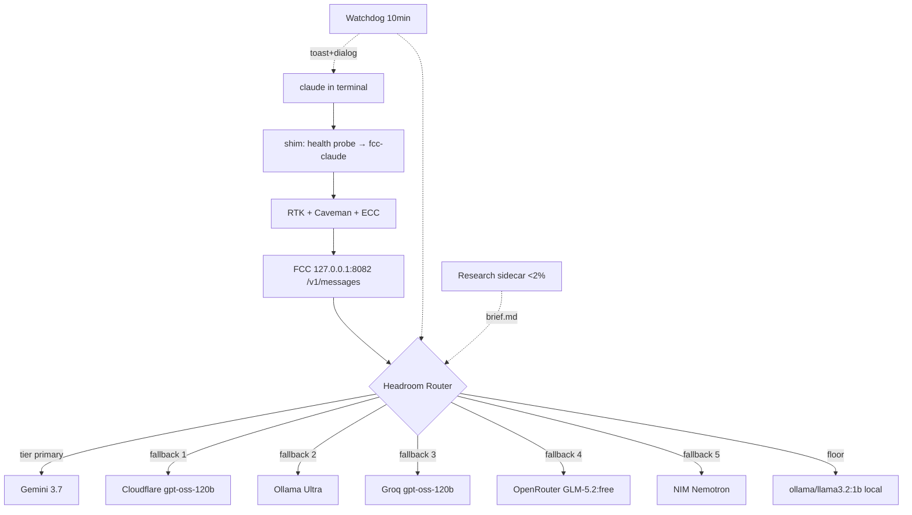

# UnClaude — One Command, Unlimited Claude

> Free pools, headroom routing, local fallback. No `claude.ai` billing. Just `claude`.

[](https://github.com/demolished-lab/unclaude/actions)
[](LICENSE)
[](pyproject.toml)
[](#install)

**UnClaude** gives you a *feels-unlimited* Claude Code without touching `claude.ai` billing. One command auto-detects your machine (OS/RAM/disk), bootstraps a local gateway that aggregates 6+ free provider pools behind one key, and routes with quota-aware headroom. When a free tier dies, a toast pops at your corner — click *Open key page* (already logged in), paste, hit Enter. Done. A `qwen2.5:0.5b` local model catches you when the internet pools thin. Background research spends <2% of session tokens to keep routes optimal.

Inspired by [Free Claude Code](https://github.com/Alishahryar1/free-claude-code), [RTK](https://github.com/rtk-ai/rtk), [Caveman](https://github.com/JuliusBrussee/caveman) and [ECC](https://github.com/affaan-m/ECC) — but fully autonomous for any device.

---

## 60-Second Start

**Windows (PowerShell)**
```powershell
irm https://raw.githubusercontent.com/demolished-lab/unclaude/main/install.ps1 | iex
```

**macOS / Linux / WSL**
```bash
curl -fsSL https://raw.githubusercontent.com/demolished-lab/unclaude/main/install.sh | bash
```

Then just:
```bash
claude              # your rig — 6 free pools + local fallback
claude.exe          # bypass — direct Anthropic
```

If a key is needed, a corner toast appears → **Open key page** → paste → **Enter**. No docs hunting.

---

## What You Get

| Layer | What | Why |
|---|---|---|
| **Gateway** | FCC 5.13.10 at `127.0.0.1:8082` | One local key for 6 pools |
| **Providers** | Gemini · NVIDIA NIM · Groq · Cloudflare AI · OpenRouter `:free` · Ollama Cloud + local `ollama` | ~230 genuinely-free chat models, 555 total catalog |
| **Routing** | Tier primaries (`MODEL_FABLE/OPUS/SONNET/HAIKU`) → fallback chain reordered by headroom% + latency | Burns deepest pools first, re-ascends after daily reset |
| **Floor** | `ollama/llama3.2:1b` (1.3GB, 16GB RAM) — device-scaled | Infinite when remote pools thin |
| **Compression** | RTK (input, ~80%) + Caveman (output, ~65%) | 3-5x more free tokens per day |
| **Discipline** | ECC 2.2.0 — 68 agents, 286 skills | TDD/review/planning loops |
| **Watchdog** | 10-min cycle, headroom-aware, catalog heal | Toast + paste-panel, disk guard, token alarm |

---

## Architecture



---

## Device Adaptive

| RAM | Daily budget | Local model |
|---|---|---|
| 8-12 GB | 1.5M tokens | `qwen2.5:0.5b` (397 MB) |
| 16 GB | 2.0M | `llama3.2:1b` (1.3 GB) |
| 32 GB+ | 2.5M | `qwen3:8b` (5.2 GB) |

Disk guard warns at <15 GB free (C: 25GB / E: 18GB on reference box).

---

## Docs

| Doc | Governs |
|---|---|
| [PRD.md](PRD.md) | What we ship (FR-1.1..FR-11.2) |
| [BLUEPRINT.md](BLUEPRINT.md) | How it's wired (routing, anomaly matrix, meta-engine) |
| [DESIGN-BRIEF.md](DESIGN-BRIEF.md) | How it looks (tokens, S-1..S-7, flows) |
| [SECURITY-AUDIT.md](SECURITY-AUDIT.md) | Gates G-1..G-7 (must pass before release) |
| [rig/](rig/) | Phase-0 scaffold + watchdog |

---

## Verify

```bash
python -m rig.cli scan --dry-run
python -m rig.watchdog.watchdog --once --dry-run
python rig/detect/device.py
```

Dashboard: `http://127.0.0.1:8082/admin` — see which provider actually served.

---

## License

MIT — see [LICENSE](LICENSE). Provider ToS respected, no account farming.

## Acknowledgments

Built on [Free Claude Code](https://github.com/Alishahryar1/free-claude-code), [RTK](https://github.com/rtk-ai/rtk), [Caveman](https://github.com/JuliusBrussee/caveman), [ECC](https://github.com/affaan-m/ECC). Maintained by [demolished-lab](https://github.com/demolished-lab).
